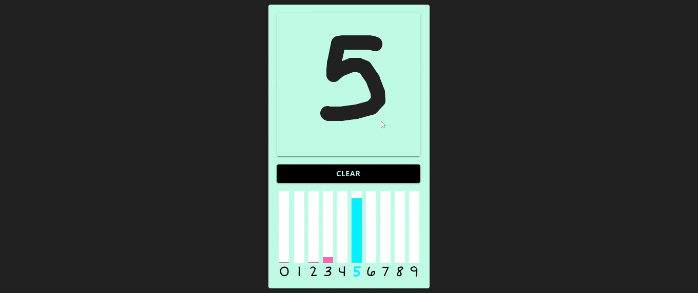

# MNSIT on browser classification task
[sitelink](https://swarajpurohit.me/MNIST-onnx/)

## Introduction
I was bored and wanted to try something new, and hence I found this [MNIST dataset](https://www.kaggle.com/c/digit-recognizer).
so i coded a simple model to classify the digits on browser runtime.with the help of [Python](https://www.python.org/), [PyTorch](https://pytorch.org/), [ONNX](https://onnx.ai/)

